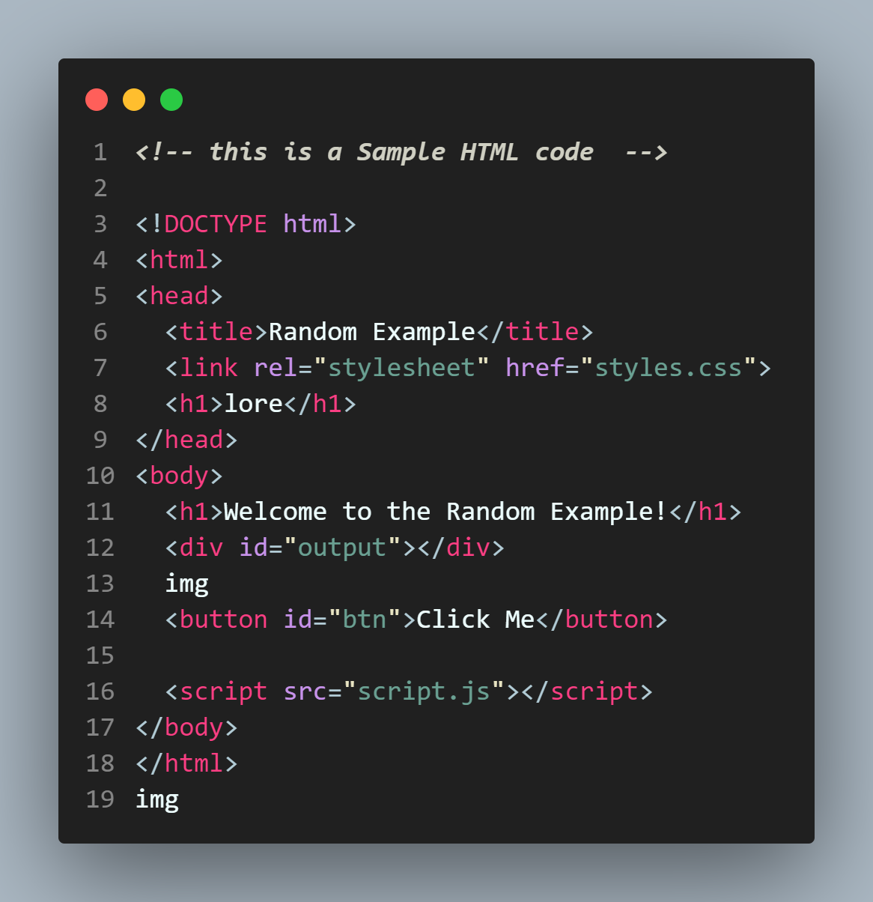
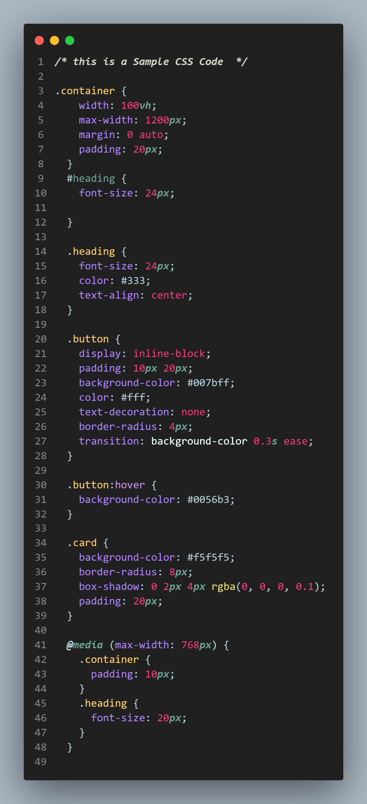
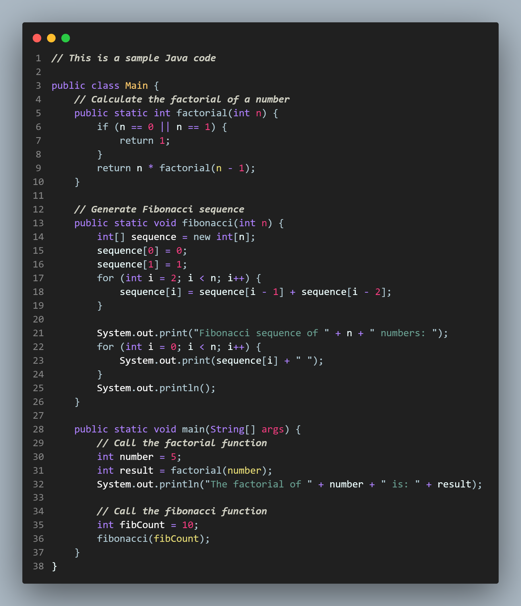
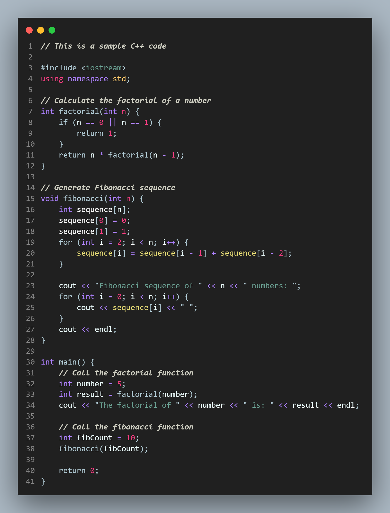
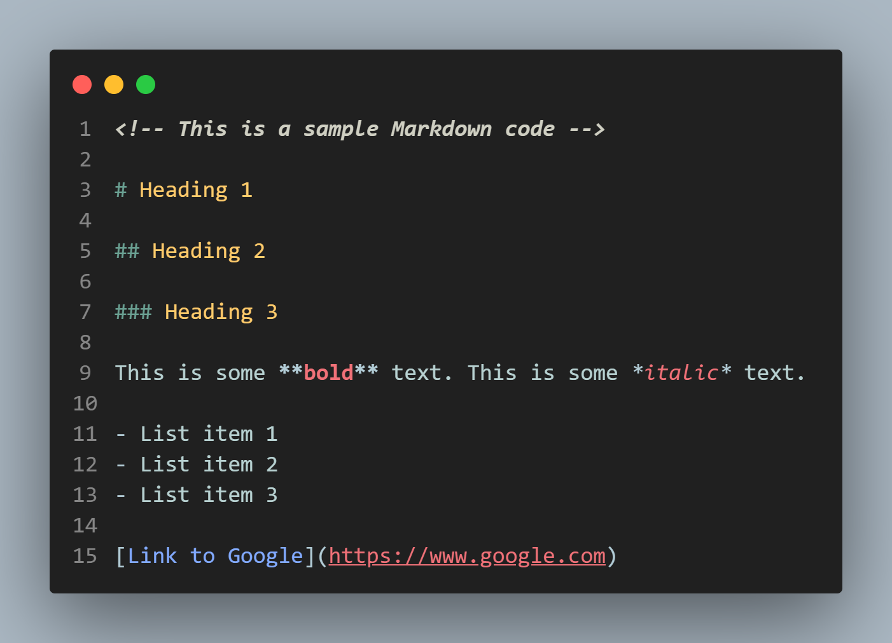

# [CurlyBraces dark Theme](https://github.com/Nikhar-savaliya/curlybraces-dark) 
 

## feel free to contribute **↓**
### **github repository :**  https://github.com/Nikhar-savaliya/curlybraces-dark
 

 

## **Features**
    - custom color Scheme
    - Bold and Italic Comments
    - customized CSS units color and font-style

## ScreenShots

## HTML

 

## CSS

 

## JS

 

## Java

 

## C++

 

## MarkDown

 

